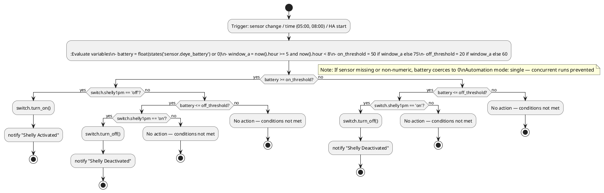

# Pseudocode Diagram — Shelly Dynamic Threshold

This diagram visualizes the exact decision flow and actions executed by `shelly_dynamic_threshold.yaml`.

View in VS Code with a Mermaid preview extension or paste the mermaid block into https://mermaid.live.



## Pseudocode (equivalent)

```text
battery = float(states('sensor.deye_battery') or 0)
window_a = (now().hour >= 5) and (now().hour < 8)
on_threshold = 50 if window_a else 75
off_threshold = 20 if window_a else 60

if battery >= on_threshold and states('switch.shelly1pm') == 'off':
    call service switch.turn_on
    notify("Shelly Activated", details)
elif battery <= off_threshold and states('switch.shelly1pm') == 'on':
    call service switch.turn_off
    notify("Shelly Deactivated", details)
else:
    # No action
    pass
```

If you want a PNG/SVG export of this diagram, I can render it and add the image file to the repo.
